# if-else and for-loop Assignments (Java)

Homework solutions for the four assignments **`for_1.pdf`**, **`for_2.pdf`**,
**`if_else_1.pdf`** and **`if_else_2.pdf`**. Every question has been written as
a small, self-contained Java program, compiled with **JDK 17**, and run so the
sample output below is real (not made up).

The original question sheets are kept in [`assignments/`](assignments).

## Contents

| # | Assignment | Question | Program | Class |
|---|-----------|----------|---------|-------|
| 1 | `for_1` | Print the series 100, 95, 90, …, 5 | [`Q1_Series.java`](for_1/Q1_Series.java) | `Q1_Series` |
| 2 | `for_1` | Sum of all odd numbers between two numbers | [`Q2_SumOfOdd.java`](for_1/Q2_SumOfOdd.java) | `Q2_SumOfOdd` |
| 3 | `for_1` | Display patterns (a) and (b) | [`Q3_Patterns.java`](for_1/Q3_Patterns.java) | `Q3_Patterns` |
| 4 | `for_2` | Print the name as many times as the age | [`Q1_NameByAge.java`](for_2/Q1_NameByAge.java) | `Q1_NameByAge` |
| 5 | `for_2` | Generate the number triangle | [`Q2_TrianglePattern.java`](for_2/Q2_TrianglePattern.java) | `Q2_TrianglePattern` |
| 6 | `for_2` | Multiplication table of a number | [`Q3_MultiplicationTable.java`](for_2/Q3_MultiplicationTable.java) | `Q3_MultiplicationTable` |
| 7 | `if_else_1` | Montek company allowance / salary | [`Q1_MontekSalary.java`](if_else_1/Q1_MontekSalary.java) | `Q1_MontekSalary` |
| 8 | `if_else_1` | Computer capabilities using `switch` | [`Q2_ComputerCapabilities.java`](if_else_1/Q2_ComputerCapabilities.java) | `Q2_ComputerCapabilities` |
| 9 | `if_else_2` | Difference between two numbers | [`Q1_DifferenceCheck.java`](if_else_2/Q1_DifferenceCheck.java) | `Q1_DifferenceCheck` |
| 10 | `if_else_2` | Student grade from marks | [`Q2_GradeEvaluator.java`](if_else_2/Q2_GradeEvaluator.java) | `Q2_GradeEvaluator` |
| 11 | `if_else_2` | Conditionally print x and y | [`Q3_PrintXandY.java`](if_else_2/Q3_PrintXandY.java) | `Q3_PrintXandY` |

## How to compile and run

You need a JDK (tested with **JDK 17**). From the repository root:

**Windows (PowerShell)**
```powershell
javac -d out (Get-ChildItem -Recurse -Filter *.java).FullName
java -cp out Q1_Series
```

**macOS / Linux**
```bash
javac -d out $(find . -name "*.java")
java -cp out Q1_Series
```

Replace `Q1_Series` with the class name of any program in the table above.
Programs that ask for input read from the keyboard.

---

## for_1

### Q1 – Series 100, 95, 90, …, 5
**File:** `for_1/Q1_Series.java`

```java
for (int i = 100; i >= 5; i -= 5) {
    System.out.print(i);
    if (i > 5) System.out.print(", ");
}
```

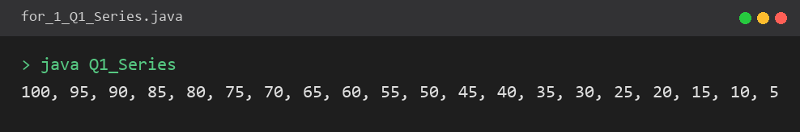

```
100, 95, 90, 85, 80, 75, 70, 65, 60, 55, 50, 45, 40, 35, 30, 25, 20, 15, 10, 5
```

### Q2 – Sum of all odd numbers between two numbers
**File:** `for_1/Q2_SumOfOdd.java`

The lower and upper input values are found with `Math.min`/`Math.max`, then the
loop adds every odd number strictly *between* them.

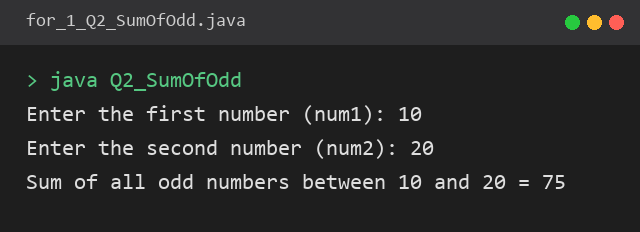

```
Enter the first number (num1): 10
Enter the second number (num2): 20
Sum of all odd numbers between 10 and 20 = 75
```
(11 + 13 + 15 + 17 + 19 = 75)

### Q3 – Display patterns
**File:** `for_1/Q3_Patterns.java`

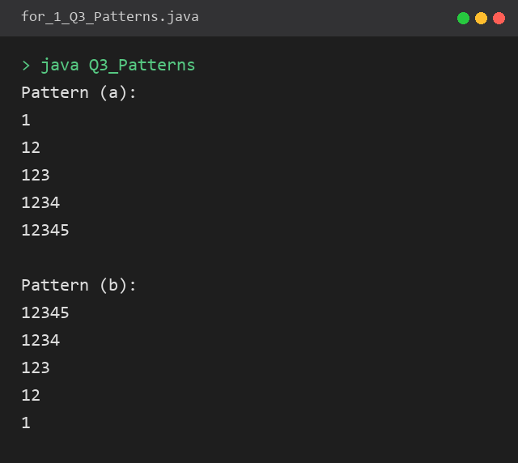

```
Pattern (a):        Pattern (b):
1                   12345
12                  1234
123                 123
1234                12
12345               1
```

---

## for_2

### Q1 – Print the name as many times as the age
**File:** `for_2/Q1_NameByAge.java`

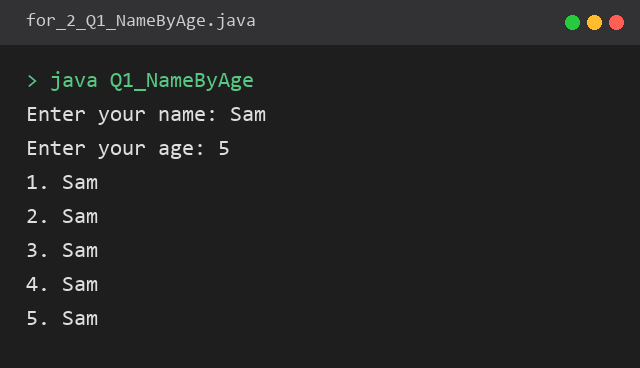

```
Enter your name: Sam
Enter your age: 5
1. Sam
2. Sam
3. Sam
4. Sam
5. Sam
```

### Q2 – Number triangle
**File:** `for_2/Q2_TrianglePattern.java`

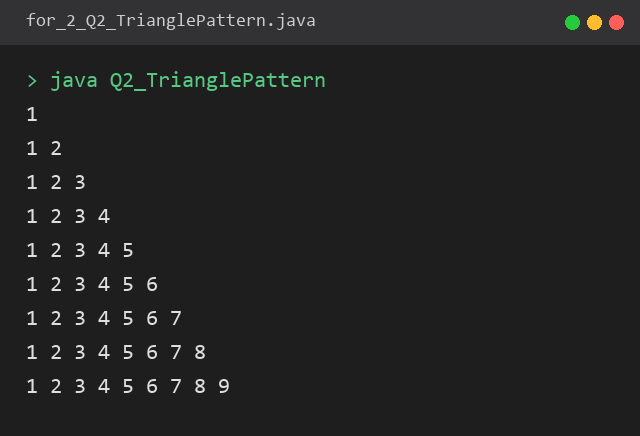

```
1
1 2
1 2 3
1 2 3 4
1 2 3 4 5
1 2 3 4 5 6
1 2 3 4 5 6 7
1 2 3 4 5 6 7 8
1 2 3 4 5 6 7 8 9
```

### Q3 – Multiplication table
**File:** `for_2/Q3_MultiplicationTable.java`

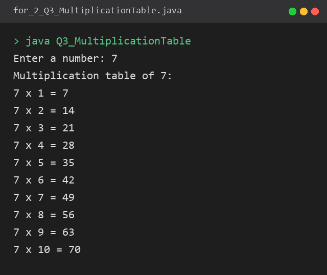

```
Enter a number: 7
Multiplication table of 7:
7 x 1 = 7
7 x 2 = 14
7 x 3 = 21
7 x 4 = 28
7 x 5 = 35
7 x 6 = 42
7 x 7 = 49
7 x 8 = 56
7 x 9 = 63
7 x 10 = 70
```

---

## if_else_1

### Q1 – Montek company allowance
**File:** `if_else_1/Q1_MontekSalary.java`

Allowances: **A = 300**, **B = 250**, **others = 100**. The allowance is added
to the salary entered by the user.

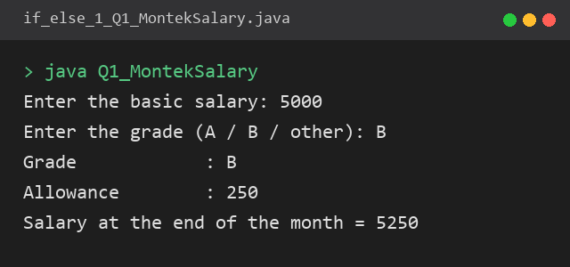

```
Enter the basic salary: 5000
Enter the grade (A / B / other): B
Grade            : B
Allowance        : 250
Salary at the end of the month = 5250
```

### Q2 – Computer capabilities (`switch`)
**File:** `if_else_1/Q2_ComputerCapabilities.java`

The entered letter is upper-cased first, so a single `case` handles both cases
(e.g. `a` and `A`). The `default` label prints a message for anything else.

| Input | Output |
|-------|--------|
| A / a | Ada |
| B / b | Basic |
| C / c | Cobol |
| D / d | dBase III |
| F / f | Fortran |
| P / p | Pascal |
| V / v | Visual C++ |

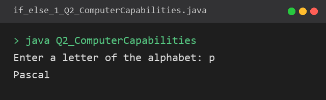

```
Enter a letter of the alphabet: p
Pascal
```

---

## if_else_2

### Q1 – Difference between two numbers
**File:** `if_else_2/Q1_DifferenceCheck.java`

Computes the absolute difference, then checks whether it matches either value
that was entered.

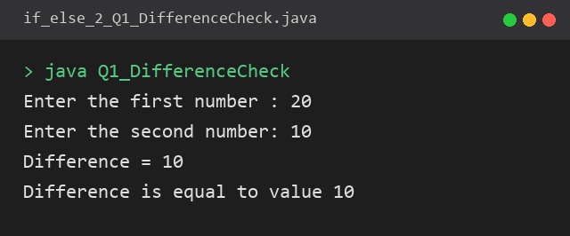

```
Enter the first number : 20
Enter the second number: 10
Difference = 10
Difference is equal to value 10
```

### Q2 – Student grade
**File:** `if_else_2/Q2_GradeEvaluator.java`

| Marks | Grade |
|-------|-------|
| > 75 | A |
| 60 – 75 | B |
| 45 – 60 | C |
| 35 – 45 | D |
| < 35 | E |

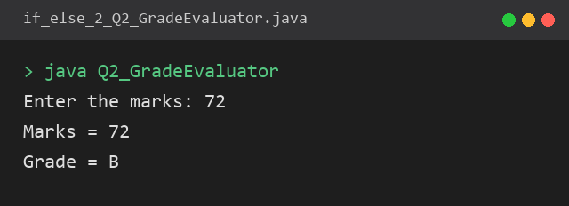

```
Enter the marks: 72
Marks = 72
Grade = B
```

### Q3 – Conditionally print x and y
**File:** `if_else_2/Q3_PrintXandY.java`

`x` is printed only when `x < 2000 || x > 3000`, and `y` only when
`100 < y < 500`. Edit the two values at the top of the file to test other cases.

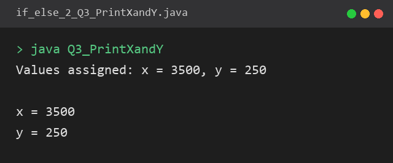

```
Values assigned: x = 3500, y = 250

x = 3500
y = 250
```

---

## Notes on interpretation

A few questions are open to more than one reading. These are the choices made:

- **for_1 Q2** – *"between the two numbers"* is treated as **exclusive** of the
  two entered numbers (only the numbers in between are used). To include the
  end points, change the loop bounds to `i = low` / `i <= high`.
- **if_else_2 Q1** – the **absolute** difference is used so the result is never
  negative.
- **if_else_2 Q2** – grades are checked from the highest band downwards, so a
  mark of exactly **75** falls into grade **B**.
- **if_else_2 Q3** – *"between 100 and 500"* is treated as **strict**
  (`100 < y < 500`).

## Repository layout

```
.
├── assignments/            # the original question PDFs
├── for_1/                  # solutions to for_1.pdf
├── for_2/                  # solutions to for_2.pdf
├── if_else_1/              # solutions to if_else_1.pdf
├── if_else_2/              # solutions to if_else_2.pdf
└── docs/
    ├── outputs/            # raw text captured from each run
    └── screenshots/        # console screenshots used in this README
```
